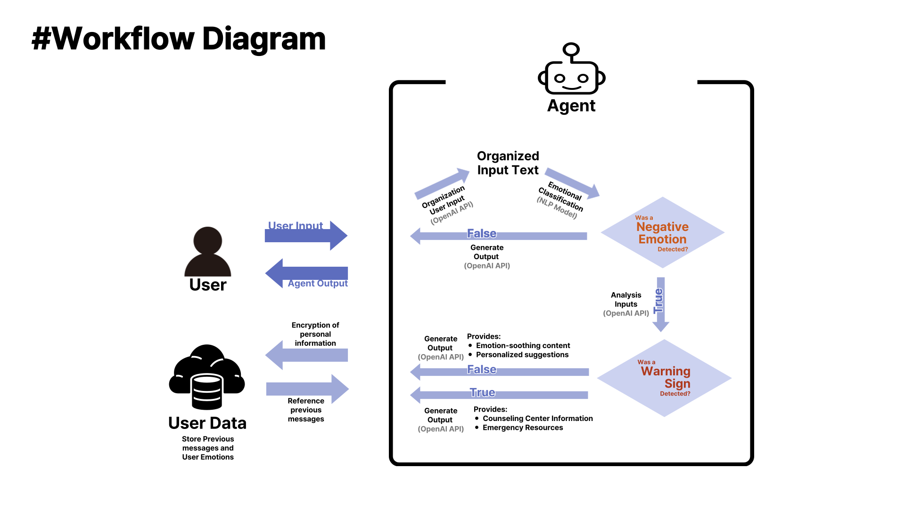

# Mindcare_Prototype

## Design
### 목적 및 목표
 본 시스템은 사용자가 입력한 감정 기반 텍스트를 바탕으로 감정을 분류하고, 우울감·스트레스 등의 심리적 신호에 맞춰
명상·운동·음악 추천 등의 중재 콘텐츠를 제공하는 것을 목표로 한다. 
극단적 표현이 감지될 경우 위기 대응 분기로 전환하여 상담센터 등을 안내한다.

### 전체 흐름
1. 사용자 감정 텍스트 입력
2. 감정 분석 및 사용자 텍스트 분석(LLM 또는 분류 모델 활용, 이전 상담 로그 활용)
3. 중재 콘텐츠 추천 또는 위기 대응 안내(중재 콘텐츠 추천은 시간 관계상 구현하지 못했습니다..)
4. 사용자 응답에 따라 반복 또는 종료

### 사용할 데이터
유저 이름을 해시 함수를 이용하여 암호화한 뒤, 대화 내역과 그때 유저의 감정을 저장하여
능동적으로 개인에 대한 데이터셋을 확장해나간다.
또한, 추후 중재 콘텐츠 추천에 있어서는 웹 크롤링을 통해 데이터를 구축할 예정

## Workflow Diagram

## Implementation
### 사용자 히스토리 DB 구축
 감정 상담은 일회적이지 않으므로, 컨텍스트 보존을 위해서 대화 내용을 사용자 입력, 감정, 상담 내역, 사용자 이름을 담은 Json 파일의
형태로 저장함. 컨텍스트 보존을 위해 사용자를 식별하는 것에 고민을 하였고, 사용자 정보를 암호화해서 저장하기로 결정했다.
즉, 사용자 이름은 사용자를 식별하여 컨텍스트를 불러오기 위함으로, 개인 정보 보호를 위하여 Hash 함수를 이용하여 암호화하여 관리한다.

### User Input 처리
우선 User Input을 OpenAI를 이용하여 한번 다듬은 뒤, 감정에 따라 분류한다. 이때 "공포", "놀람", "중립", "혐오", "분노", "슬픔", 
"행복"의 7가지 라벨로 분류하는데, 이는 NLP의 대표적인 과제인 감정 분류에서 많은 모델이 사용하는 라벨과 동일하다.
따라서 이 라벨들을 사용하는 것이 어느정도 실험적으로 검증되었다는 점과, 이후 GPT보다 분류에 특화된 모델(KoBert Classifier) 등을 서비스에 이식할 때의 용이함을 고려하여 위와 같은 라벨을 사용하였다.
그 뒤, 일반적으로는 부정적인 감정에 대해서 위험 신호가 나타난다는 점을 고려하여 부정적인 감정 판별과, 위험 신호 판별을 직렬로 수행했고, 판별 결과와 판별 결과에 따른 Output 요구 사항을 이후 프롬포트에 Few-Shot으로 제공하여 적절한 대답을 내놓도록 하였다.

이때 감정 분류에 있어서 Gen-AI가 자연어 응답을 내놓아서 프로그램에 오류가 발생하는 경우가 생겼었고, 이를 해결하기 위해 라벨을 각각 1~7로 매핑하였고, 감정 분류 부분의 Gen-AI의 응답을 Int로 고정하였다. 이후 Output Int를 매핑된 라벨로 다시 복원하는 방법으로 다른 함수에서의 Gen-AI 프롬포트를 작성하였다.
